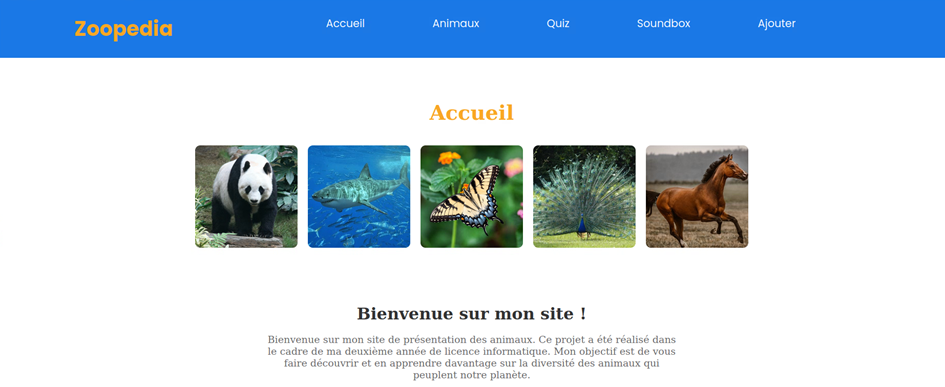

# Zoopedia

Zoopedia est mon projet de fin de deuxième année de licence informatique. Il regroupe des informations sur divers animaux avec des fonctionnalités ludiques.

## Fonctionnalités Principales



- **Page d'Accueil**: Sur la page d'accueil, vous trouverez 5 animaux générés aléatoirement à chaque rafraîchissement de la page, ainsi qu'une petite introduction.

- **Informations Détaillées**: En cliquant sur un animal, vous serez redirigé vers une page contenant des informations détaillées sur cet animal.

- **Page Animaux**: Cette page présente tous les animaux stockés dans la base de données. Vous pouvez utiliser un filtre pour trouver des animaux en fonction de leur habitat ou de leur catégorie.

- **Page Quiz**: Testez vos connaissances sur le règne animal avec un quiz thématique sur les animaux.

- **Page Soundboard**: La page Soundboard vous permet de jouer les cris de différents animaux pour une expérience sonore immersive.

- **Page Ajouter**: Vous pouvez ajouter de nouveaux animaux à la base de données grâce à la page Ajouter.

# Guide d'installation

## Prérequis

Pour lancer Zoopedia sur votre machine, assurez-vous que vous avez installé :

- PHP 8.1 ou plus récent, avec les extensions suivantes :
  - `fileinfo`
  - `zip`
  - `mysqli`
  - `pdo_mysql`

- Un service de base de données (MySQL de préférence).

## Installation de Symfony

1. Lancez votre service de base de données.

2. Installez les dépendances :
   ```bash
   composer install

3. Créez la base de données :
   ```bash
   symfony console doctrine:database:create
4. Exécutez les migrations de la base de données :
   ```bash
   symfony console doctrine:migrations:migrate
5. Chargez les données initiales avec :
   ```bash
   php bin/console doctrine:fixtures:load
6. Démarrez le serveur Symfony :
   ```bash
   symfony server:start

## Installation de Vue.js

1. Lancez votre service de base de données.
   ```bash
   npm install

2. Lancez le serveur de développement :
   ```bash
   npm run dev
   ```
Assurez-vous de naviguer sur le site lancé avec "npm run dev" et non avec "symfony server:start".
